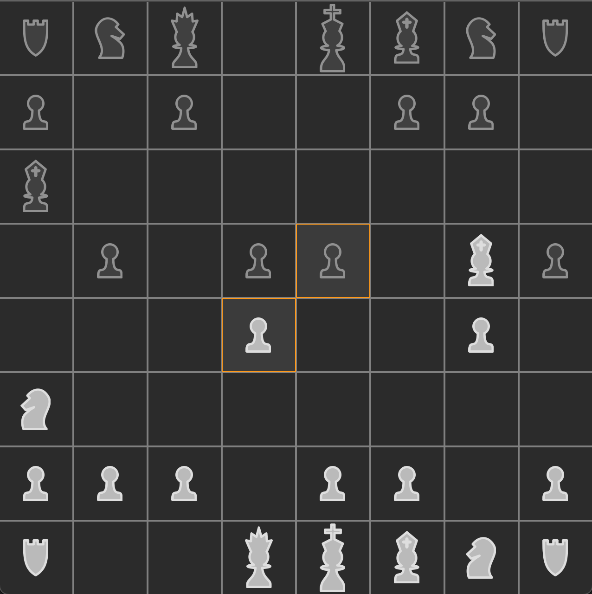
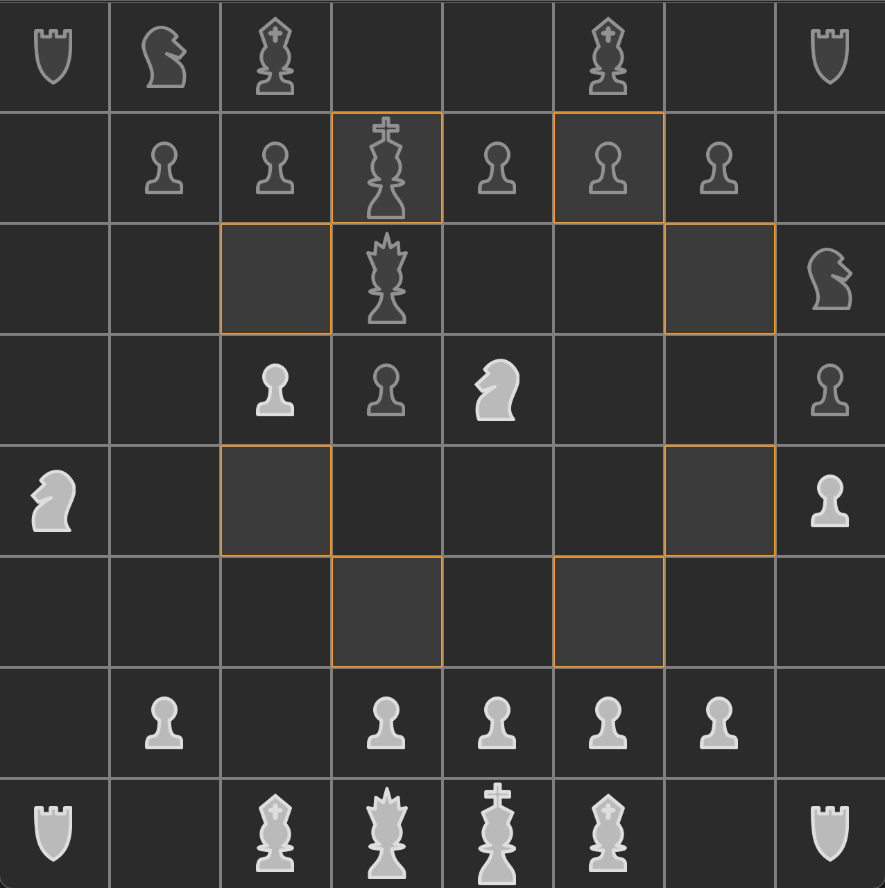
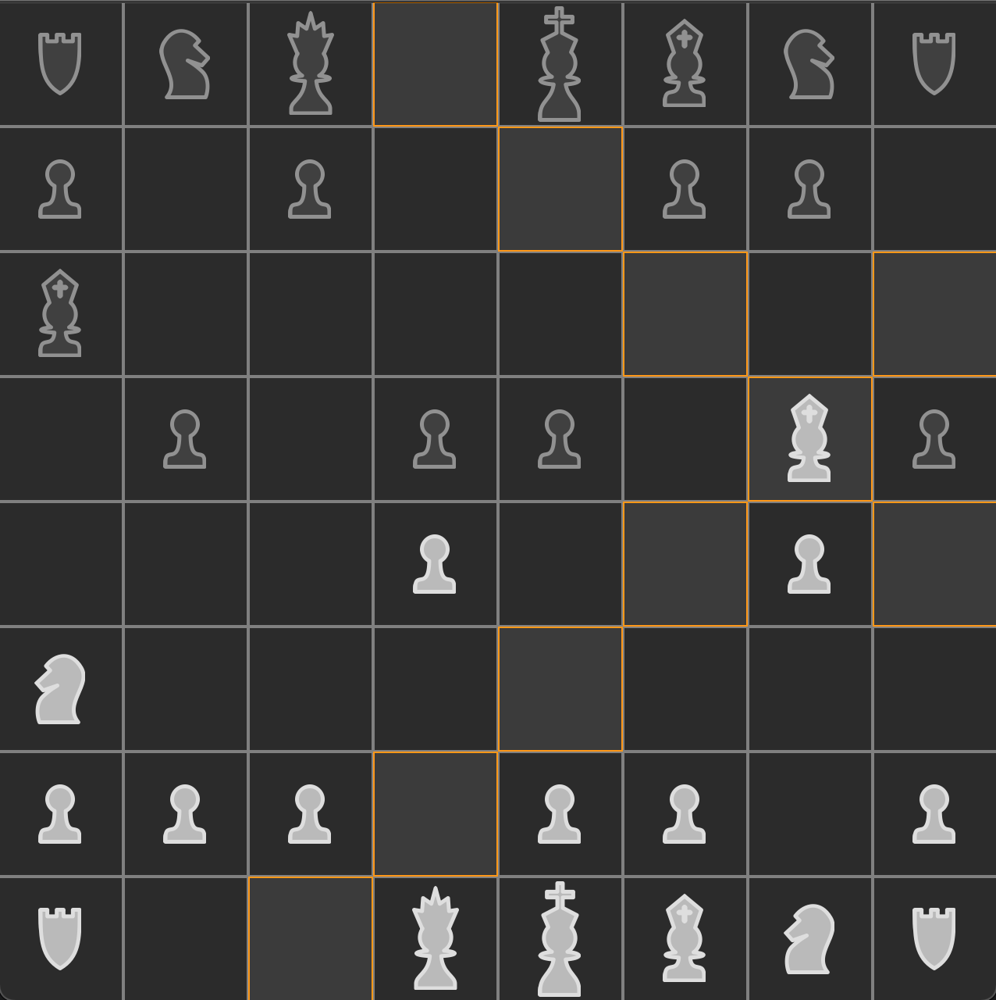

# Chees

This project is chess written in c++/qml/js (small test project for myself)

## Some screens from this version :

- Demonstration of recalculation of all possible positions and turning on the backlight: 

